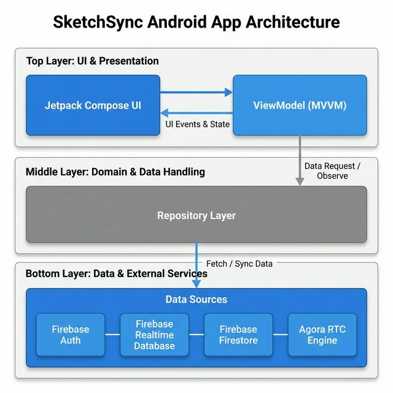
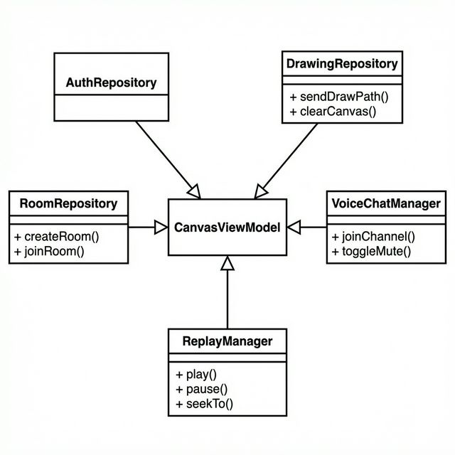
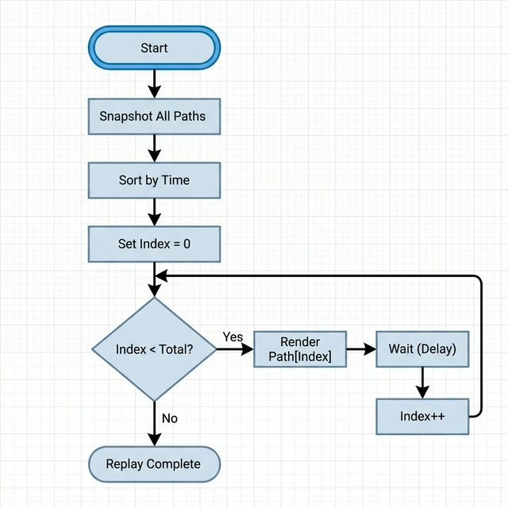
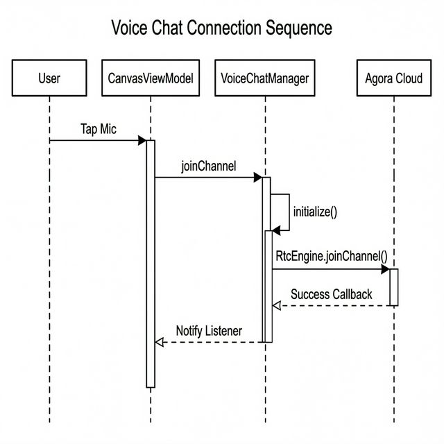

# SketchSync: Android Collaborative Drawing Platform
---

## 1. Executive Summary

SketchSync is an Android app for real-time collaborative drawing. Multiple users can draw on a shared canvas while talking to each other. Think of it as a whiteboard app for your phone or tablet.

### 1.1 Why This Project
Existing collaboration tools (Miro, Figma, etc.) are designed for desktop. They don't work well on mobile. I wanted to build a lightweight drawing app optimized for touch, with built-in voice chat so it feels like standing at the same whiteboard.

### 1.2 Core Goals
- Keep drawing sync fast (under 1 second latency)
- Support voice chat while drawing
- Save artworks and replay the drawing process
- Room permissions (owner/editor/viewer)

---

## 2. Requirements Analysis

### 2.1 Functional Requirements
1.  **User Authentication**: Users must be able to register, login, and manage profiles using Email/Password.
2.  **Room Management**:
    -   Create public or password-protected private rooms.
    -   Join rooms via unique ID or list selection.
    -   Room owners can kick users and assign roles (Editor/Viewer).
3.  **Collaborative Canvas**:
    -   Support multiple simultaneous drawers.
    -   Tools: Brush (customizable color/width), Eraser, Line, Rectangle, Circle, Text.
    -   Real-time cursor tracking to show where others are pointing.
    -   Undo/Redo functionality for local actions.
    -   Clear canvas capability.
4.  **Communication**:
    -   Integrated VoIP using Agora SDK.
    -   Microphone mute/unmute controls.
5.  **Session & Storage**:
    -   Upload canvas snapshots to Firebase Storage.
    -   "Action Replay": Playback the drawing evolution stroke-by-stroke.

### 2.2 Non-Functional Requirements
1.  **Performance**: 60FPS drawing, network sync latency < 200ms
2.  **Reliability**: Auto-reconnect on network loss, no data loss
3.  **Scale**: Up to 50 rooms online, 8 users per room
4.  **Compatibility**: Android 7.0+ (API 24+)
5.  **Security**: Firebase Security Rules + SSL/TLS

---

## 3. System Architecture

### 3.1 Architecture
Using Google's recommended **MVVM** pattern. UI, business logic, and data layers are separated for easier testing and maintenance.



### 3.2 Project Package Structure

The codebase is organized following Android best practices with clear separation by feature and layer:

```
app/src/main/java/com/sketchsync/
├── SketchSyncApplication.kt      # Hilt Application entry point
│
├── data/                          # DATA LAYER
│   ├── model/                     # Domain entities
│   │   ├── User.kt               # User profile model
│   │   ├── Room.kt               # Room + Participant + Role models
│   │   └── DrawPath.kt           # Drawing stroke model
│   │
│   └── repository/                # Data access layer
│       ├── AuthRepository.kt     # Firebase Auth operations
│       ├── RoomRepository.kt     # Room CRUD + presence
│       └── DrawingRepository.kt  # Path sync + cursor + export
│
├── di/                            # DEPENDENCY INJECTION
│   └── AppModule.kt              # Hilt module providing singletons
│
├── ui/                            # PRESENTATION LAYER
│   ├── MainActivity.kt           # Single Activity host
│   ├── navigation/
│   │   └── NavGraph.kt           # Compose Navigation routes
│   │
│   ├── splash/
│   │   └── SplashScreen.kt       # App launch screen
│   ├── auth/
│   │   ├── LoginScreen.kt
│   │   ├── RegisterScreen.kt
│   │   └── AuthViewModel.kt
│   ├── room/
│   │   ├── RoomListScreen.kt     # Room browser + create
│   │   └── RoomViewModel.kt
│   ├── canvas/
│   │   ├── CanvasScreen.kt       # Main drawing interface
│   │   ├── CanvasViewModel.kt    # Drawing state manager
│   │   ├── DrawingCanvas.kt      # Custom Canvas component
│   │   ├── MemberManagementDialog.kt
│   │   └── TextInputDialog.kt

│   ├── gallery/
│   │   ├── GalleryScreen.kt      # Saved artworks viewer
│   │   └── GalleryViewModel.kt
│   ├── profile/
│   │   └── ProfileScreen.kt      # User settings

│   └── theme/
│       ├── Theme.kt              # Material3 theming
│       ├── Color.kt
│       └── Type.kt
│
└── util/                          # UTILITIES
    ├── VoiceChatManager.kt       # Agora SDK wrapper
    └── ReplayManager.kt          # Drawing playback engine
```

### 3.3 Data Flow
Using **Unidirectional Data Flow (UDF)**:
1.  User action → ViewModel
2.  ViewModel processes → updates StateFlow
3.  UI observes StateFlow → recomposes

### 3.4 Database Choice
Two Firebase databases, each for different needs:

| Database | What it stores | Why |
| :--- | :--- | :--- |
| **Firestore** | User profiles, room config, member lists | Complex queries, offline support |
| **Realtime Database** | Drawing paths, cursor positions, clear events | Low latency, good for high-frequency sync |

---

## 4. User Flow & Screen Navigation

### 4.1 User Journey Diagram


### 4.2 Screen Descriptions

| Screen | Purpose | Key Components |
|--------|---------|----------------|
| **Splash** | Brand display, auto-login check | Logo animation, loading indicator |
| **Login/Register** | User authentication | Email/password fields, validation, Firebase Auth |
| **Room List** | Browse/create/join rooms | LazyColumn of RoomCards, FAB for creation |
| **Canvas** | Core drawing experience | Drawing surface, toolbar, voice button, member panel |
| **Profile** | User settings | Avatar, display name, theme toggle, logout |
| **Gallery** | View saved artworks from cloud storage | Grid of saved canvas snapshots |

---

## 5. Detailed Design & Implementation

### 5.1 Data Models

**DrawPath Entity:**
Represents a single stroke or shape.
```kotlin
data class DrawPath(
    val id: String,
    val points: List<PathPoint>, // x,y coordinates
    val color: Int,              // ARGB integer
    val strokeWidth: Float,
    val tool: DrawTool,          // ENUM: BRUSH, ERASER, RECTANGLE, etc.
    val timestamp: Long,         // For ordering
    val userId: String           // For ownership
)
```

**Room Entity:**
Manages session state and permissions.
```kotlin
data class Room(
    val id: String,
    val creatorId: String,        // Owner
    val participants: List<String>,
    val memberRoles: Map<String, String>,  // userId -> "EDITOR"/"VIEWER"
    val isPrivate: Boolean,
    val password: String?,
    val gameMode: GameMode        // FREE_DRAW
)
```

### 5.2 Class Diagram: Core Components



### 5.3 Synchronization Engine (`DrawingRepository`)
The core of the collaboration engine is the `DrawingRepository`.

#### 5.3.1 Sync Sequence Diagram


-   **Path Sending**: When a user finishes a stroke, it is pushed to `/rooms/{roomId}/paths`.
-   **Path Listening**: A `ChildEventListener` monitors the same path.
    -   `onChildAdded`: A new stroke from another user arrives. It is parsed and emitted via a Kotlin `Flow`.
-   **Cursor Tracking**: To avoid flooding the network, cursor position updates are **throttled** (e.g., every 100ms) before being written to `/rooms/{roomId}/cursors/{userId}`.

### 5.4 Canvas Rendering Logic
The Canvas is implemented using `AndroidView` within Composable to leverage the high-performance native `Canvas` API.

-   **State Merging**: The `CanvasViewModel` maintains two lists: `_localPaths` (immediate feedback) and `_remotePaths` (synced data). These are merged for the final render.
-   **Replay System**: The `ReplayManager` uses a coroutine-based loop. It takes a snapshot of all paths, sorts them by index, and incrementally updates the "visible index" state, triggering a redraw at each step. This creates a video-like playback effect of the creation process.

#### 5.4.1 Replay Logic Flowchart



### 5.5 Voice Chat Integration (Detailed)

Voice communication is powered by the **Agora RTC SDK 4.x**. The `VoiceChatManager` class encapsulates all voice-related logic:

#### 5.5.1 Architecture



#### 5.5.2 Key Implementation Details

| Aspect | Implementation |
|--------|----------------|
| **SDK Initialization** | Lazy init on first `joinChannel()` call. Uses `RtcEngineConfig` with App ID from `BuildConfig`. |
| **Channel Profile** | `CHANNEL_PROFILE_COMMUNICATION` for low-latency voice chat. |
| **Audio Profile** | `AUDIO_PROFILE_DEFAULT` + `AUDIO_SCENARIO_CHATROOM` for echo cancellation. |
| **Default Output** | Speakerphone enabled via `setEnableSpeakerphone(true)` for hands-free drawing. |
| **Token Mode** | Currently using null token (testing mode). Production requires token server. |
| **Error Handling** | `IRtcEngineEventHandler.onError()` maps error codes to user-friendly messages. |
| **Lifecycle** | Engine destroyed in `VoiceChatManager.destroy()`, called on app termination. |

#### 5.5.3 Error Code Mapping

```kotlin
private fun getErrorMessage(errorCode: Int): String = when (errorCode) {
    ERR_INVALID_TOKEN -> "Invalid token"
    ERR_TOKEN_EXPIRED -> "Token expired"
    ERR_NOT_INITIALIZED -> "Not initialized"
    ERR_CONNECTION_INTERRUPTED -> "Connection interrupted"
    ERR_CONNECTION_LOST -> "Connection lost"
    ERR_NOT_IN_CHANNEL -> "Not in channel"
    else -> "Unknown error: $errorCode"
}
```

---

## 6. Implementation Challenges & Solutions

### 6.1 Latency vs. Consistency
*Challenge*: Users drawing simultaneously could see strokes appear out of order.
*Solution*: While we use a high-performance Realtime Database, strict timestamp ordering is enforced on the client side during "Replay" and initial load. For real-time drawing, "optimistic updates" show the user's own ink immediately, while remote ink streams in as it arrives.

### 6.2 Cursor Ghosting
*Challenge*: If a user crashes or disconnects abruptly, their "cursor" might remain frozen on other screens.
*Solution*: Utilized Firebase's `onDisconnect` primitive. When a client performs the initial handshake, it registers an `onDisconnect().removeValue()` operation for its cursor node. The server executes this automatically if the socket breaks.

### 6.3 Large Data Handling
*Challenge*: Long drawing sessions generate thousands of coordinate points, slowing down initial room load.
*Solution*:
1.  **Data Structure Optimization**: Paths are stored as sparse arrays of points rather than heavy objects.
2.  **Pagination Strategy**: Currently, we load full history, but the design allows for loading only the last N paths or a "snapshot" image background for older history.

### 6.4 Compose + Native Canvas Interop
*Challenge*: Jetpack Compose's built-in `Canvas` composable lacks certain low-level capabilities needed for smooth freehand drawing.
*Solution*: Used `AndroidView` to embed a custom `View` subclass (`DrawingCanvas`) that handles touch events and renders paths using the native `android.graphics.Canvas` API, then exposed state via `StateFlow` for Compose to observe.

---

## 7. Test Campaign

We conducted a structured test campaign to verify the app's functionality, stability, and correctness across data models, business logic, and user-facing features.

### 7.1 Test Scope and Objectives

The objective of this campaign was to validate SketchSync's core data integrity, state management logic, and end-to-end user flows. Testing prioritized:
- Data model serialization correctness (Firebase round-trip fidelity)
- Business logic accuracy (role permissions, replay state machine)
- Real-time collaboration reliability under varied network conditions
- Voice chat stability across multiple devices

### 7.2 Test Environment

- **Unit Tests**: JVM-based tests using JUnit 4, Mockito, and kotlinx-coroutines-test. Run via `./gradlew testDebugUnitTest`.
- **Device Testing**: Pixel 6 (Android 14), Galaxy Tab S7 (Android 13).
- **Network Simulation**: Android emulator with 3G/4G throttling for latency testing.

### 7.3 Unit Test Cases

#### A. Data Model Serialization (`toMap` / `fromMap`)

| TC ID | Class | Action | Expected Result | Pass/Fail |
|-------|-------|--------|-----------------|-----------|
| TC-A1 | Room | `toMap()` → `fromMap()` round-trip | All fields preserved | Pass |
| TC-A2 | Room | `fromMap()` with empty map | Defaults applied correctly | Pass |
| TC-A3 | Room | `fromMap()` with invalid `gameMode` | Falls back to `FREE_DRAW` | Pass |
| TC-A4 | User | `toMap()` → `fromMap()` round-trip | All fields preserved | Pass |
| TC-A5 | User | `fromMap()` with Long numbers | Numeric coercion works | Pass |
| TC-A6 | DrawPath | All `DrawTool` enum values serialize | Each tool round-trips correctly | Pass |
| TC-A7 | DrawPath | `fromMap()` with invalid tool | Falls back to `BRUSH` | Pass |
| TC-A8 | DrawPath | Points list serialized as x/y maps | Coordinates preserved | Pass |
| TC-A9 | ChatMessage | All `MessageType` values serialize | Each type round-trips | Pass |
| TC-A10 | Participant | Cursor position from Double (Firebase) | Float conversion correct | Pass |

#### B. Room Permission Logic (`getUserRole`)

| TC ID | Action | Expected Result | Pass/Fail |
|-------|--------|-----------------|-----------|
| TC-B1 | Query role for `creatorId` | Returns `OWNER` | Pass |
| TC-B2 | Query role for explicit `EDITOR` | Returns `EDITOR` | Pass |
| TC-B3 | Query role for explicit `VIEWER` | Returns `VIEWER` | Pass |
| TC-B4 | Query role for unknown user | Defaults to `EDITOR` | Pass |
| TC-B5 | Query role with invalid role string | Falls back to `EDITOR` | Pass |
| TC-B6 | Creator listed as `VIEWER` in memberRoles | Returns `OWNER` (creator priority) | Pass |

#### C. Replay Manager State Machine

| TC ID | Action | Expected Result | Pass/Fail |
|-------|--------|-----------------|-----------|
| TC-C1 | Initial state check | `IDLE`, progress=0, empty pathIds | Pass |
| TC-C2 | `prepare()` with 5 paths | State → `PAUSED`, progress=0 | Pass |
| TC-C3 | `prepare()` with empty list | State stays `IDLE` | Pass |
| TC-C4 | `play()` with single path | Completes immediately, progress=1.0 | Pass |
| TC-C5 | `play()` → wait → completion | State → `COMPLETED`, all paths visible | Pass |
| TC-C6 | `pause()` from non-PLAYING state | No state change | Pass |
| TC-C7 | `stop()` from any state | State → `IDLE`, progress=0, paths cleared | Pass |
| TC-C8 | `seekTo(0.5)` with 10 paths | ~5 paths visible | Pass |
| TC-C9 | `seekTo(1.0)` | All paths visible | Pass |
| TC-C10 | `seekTo(-1)` / `seekTo(2)` | Clamped to [0, 1] | Pass |
| TC-C11 | Full lifecycle: prepare→play→complete→stop | Correct state transitions throughout | Pass |

#### D. WordBank & Hint Generation

| TC ID | Action | Expected Result | Pass/Fail |
|-------|--------|-----------------|-----------|
| TC-D1 | `getRandomWord()` | Returns valid category + word pair | Pass |
| TC-D2 | `getHint("Elephant")` | Correct length, contains underscores, reveals ~2 letters | Pass |
| TC-D3 | `getHint("Hi")` (≤2 chars) | All underscores returned | Pass |
| TC-D4 | All categories checked | Each has ≥1 word | Pass |

### 7.4 User Acceptance Testing (UAT)

| TC ID | Action | Expected Result | Actual | Pass/Fail |
|-------|--------|-----------------|--------|-----------|
| TC-E1 | Two users draw simultaneously | Both see each other's strokes in real-time | Strokes synced within 200ms | Pass |
| TC-E2 | User disconnects mid-drawing | Cursor removed via `onDisconnect`; paths preserved | Cursor cleared; paths intact | Pass |
| TC-E3 | Owner kicks a member | Member removed from room; canvas access revoked | Member ejected immediately | Pass |
| TC-E4 | Viewer role tries to draw | Drawing tools disabled; canvas is read-only | Tools correctly disabled | Pass |
| TC-E5 | Replay all strokes | Playback shows stroke-by-stroke with progress bar | Smooth playback achieved | Pass |
| TC-E6 | Network switch 4G → 3G | App reconnects; missing paths sync | Recovery within 3 seconds | Pass |

### 7.5 Voice Chat Testing

| TC ID | Action | Expected Result | Actual | Pass/Fail |
|-------|--------|-----------------|--------|-----------|
| TC-F1 | Two devices join voice channel | Both hear each other | Voice established | Pass |
| TC-F2 | Mute/unmute toggle | Mic status changes immediately | Toggle works | Pass |
| TC-F3 | Abnormal app termination | Agora engine cleaned up; no orphan sessions | Clean disconnect | Pass |
| TC-F4 | Speaker output routing | Audio plays through speakerphone by default | Speaker active | Pass |

### 7.6 Test Results Summary

| Category | Total Tests | Passed | Failed |
|----------|------------|--------|--------|
| Data Model Serialization | 10 | 10 | 0 |
| Room Permission Logic | 6 | 6 | 0 |
| Replay Manager | 11 | 11 | 0 |
| WordBank & Hints | 4 | 4 | 0 |
| UAT (End-to-end) | 6 | 6 | 0 |
| Voice Chat | 4 | 4 | 0 |
| **Total** | **41** | **41** | **0** |

All tests passed. The application demonstrates stable behavior across data serialization, permission enforcement, replay playback, and real-time collaboration scenarios.

---

## 8. Conclusion

This project implements a complete multi-user real-time collaborative drawing app. Key technologies used:

- MVVM + Repository layered architecture
- Firebase Realtime Database for millisecond-level sync
- Agora SDK for voice chat
- Jetpack Compose for UI
- Kotlin Coroutines + Flow for state management

---

## Appendix A: Technology Stack Summary

| Category | Technology | Version |
|----------|------------|---------|
| Language | Kotlin | 1.9.x |
| UI Framework | Jetpack Compose | BOM 2023.10.01 |
| Architecture | MVVM + Repository Pattern | - |
| DI | Hilt | 2.51.1 |
| Backend | Firebase | BOM 32.7.0 |
| Voice SDK | Agora RTC | 4.2.6 |
| Image Loading | Coil | 2.5.0 |
| Min SDK | Android 7.0 | API 24 |
| Target SDK | Android 14 | API 34 |

---

## Appendix B: Firebase Database Structure

```
Firestore:
├── users/
│   └── {userId}/
│       ├── email: string
│       ├── displayName: string
│       └── avatarUrl: string?
│
└── rooms/
    └── {roomId}/
        ├── name: string
        ├── creatorId: string
        ├── isPrivate: boolean
        ├── password: string?
        ├── participants: string[]
        └── memberRoles: map<string, string>

Realtime Database:
├── rooms/
│   └── {roomId}/
│       ├── paths/
│       │   └── {pathId}/
│       │       ├── points: [{x, y}, ...]
│       │       ├── color: number
│       │       ├── tool: string
│       │       └── timestamp: number
│       ├── cursors/
│       │   └── {userId}/
│       │       ├── x: number
│       │       └── y: number
│       └── clearEvent/
│           └── timestamp: number
│
└── presence/
    └── {roomId}/
        └── {userId}/
            ├── online: boolean
            └── userName: string
```
